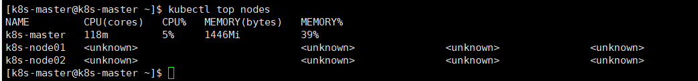

# HPA 与 VPA

HPA：HPA 是 Kubernetes 里面 pod 弹性伸缩的实现，它能根据设置的监控指标阈值进行 pod 的弹性扩缩容，
目前默认 HPA 只能支持 cpu 和内存的阀值检测扩缩容机制，但也可以通过 custom metric api 调用 prometheus 
等监控系统实现自定义 metric 来更加灵活地监控指标实现弹性伸缩。但是 HPA 不能用于伸缩一些无法进行缩放的控制器如 DaemonSet。

VPA: Vertical Pod Autoscaler，Kubernetes 纵向扩容，即用户无需为其 pods 中的容器设置 request。
配置 VPA 后，它将根据使用情况自动设置 request，从而允许在节点上进行适当的调度，为每个 pod 提供适当的资源量。

# 介绍

自从 Kubernetes 1.8 开始，指标通过 Metrics API 从 Kubernetes 中获取，从 Kubernetes 1.11 开始 Heapster 被废弃不再推荐使用，metrics-server 替代了 Heapster。

Metrics server 是 Kubernetes 集群资源使用情况的聚合器，Kubernetes 中有些组件依赖资源指标 API(metric API)，
如 top、hpa 等。如果没有运行资源指标 API 接口，这些组件无法运行。之前使用的是 Heapster，目前推荐使用 metrics-server。

Metrics API 的 api 路径是 /apis/metrics.k8s.io/。

Kubernets 将资源指标分为两种：

    core metrics 核心指标： 采集每个节点上的 kubelet 公开的 summary api 上的指标信息，通常只包含 cpu、内存使用率信息
    custom metrics 自定义指标：允许用户从外部监控系统中采集自定义指标，如应用的 qps 等

在 HPA 中，默认的扩容冷却周期是 3 分钟，缩容冷却周期是 5 分钟。
可以通过调整 kube-controller-manager 组件启动参数设置冷却时间：

     --horizontal-pod-autoscaler-downscale-delay ：扩容冷却时间参数
     --horizontal-pod-autoscaler-upscale-delay ：缩容冷却时间参数

目前 HPA 已经支持了 autoscaling/v1、autoscaling/v2beta1 和 autoscaling/v2beta2 三个大版本。

1. autoscaling/v1
    
    只支持 CPU 一个指标的弹性伸缩。
    ```
    apiVersion: autoscaling/v1
    kind: HorizontalPodAutoscaler
    metadata:
      name: php-apache
      namespace: default
    spec:
      scaleTargetRef:
        apiVersion: apps/v1
        kind: Deployment
        name: php-apache
      minReplicas: 1
      maxReplicas: 10
      targetCPUUtilizationPercentage: 50
   ```
1. autoscaling/v2beta1

    除 cadvisor 暴露的指标外，还支持自定义指标(比如 resource、pods.object、external)，比如像第三方提供的 QPS，或者基于其他的一些资源(如消息队列)进行扩缩容。
    
1. autoscaling/v2beta2
    又额外增加了外部指标支持。

Metrics Server

核心指标通过 metrics api 获取，而 Metrics Server 实现了 Resurce Metrics API。
Metrics Server 是集群范围资源使用数据的聚合器。由 Metrics Server 从每个节点上的 Kubelet 公开的 Summary API 中采集指标信息。
也就是说，如果需要使用 Kubernetes 的 HPA 功能，需要先安装 Metrics Server。

部署 [metrics-server](https://github.com/kubernetes-sigs/metrics-server)。在部署 metrics-server 之前，
请确认 Kubernetes 集群配置开启了 Aggregation Layer(聚合层)。k8s 如果是使用 kubeadm 部署的，默认的聚合层是已经启用的。参考 [前提条件](https://github.com/kubernetes-sigs/metrics-server#requirements)。

/etc/kubernetes/manifests/kube-apiserver.yaml
```
    - --proxy-client-cert-file=/etc/kubernetes/pki/front-proxy-client.crt
    - --proxy-client-key-file=/etc/kubernetes/pki/front-proxy-client.key
    - --requestheader-allowed-names=front-proxy-client
    - --requestheader-client-ca-file=/etc/kubernetes/pki/front-proxy-ca.crt
    - --requestheader-extra-headers-prefix=X-Remote-Extra-
    - --requestheader-group-headers=X-Remote-Group
    - --requestheader-username-headers=X-Remote-User
```

kubernetes/deployment 目录下的 yaml 文件介绍：

这些 yaml 文件参考于 [metrics-server](https://github.com/kubernetes-sigs/metrics-server)。

```
aggregated-metrics-reader.yaml

auth-delegator.yaml

auth-reader.yaml

metrics-apiservice.yaml

metrics-server-deployment.yaml  
替换 k8s.gcr.io/metrics-server-amd64:v0.3.6 为 mirrorgooglecontainers/metrics-server-amd64:v0.3.6 
注意 imagePullPolicy: IfNotPresent
args 参数添加 
- --kubelet-insecure-tls
- --kubelet-preferred-address-types=InternalIP,Hostname,InternalDNS,ExternalDNS,ExternalIP

metrics-server-service.yaml

resource-reader.yaml
```

以上 yaml 文件的作用，自行查找。

部署完 [metrics-server](https://github.com/kubernetes-sigs/metrics-server)后，执行 `kubectl api-versions` 操作，显示如下：

```
admissionregistration.k8s.io/v1
admissionregistration.k8s.io/v1beta1
apiextensions.k8s.io/v1
apiextensions.k8s.io/v1beta1
apiregistration.k8s.io/v1
apiregistration.k8s.io/v1beta1
apps/v1
authentication.k8s.io/v1
authentication.k8s.io/v1beta1
authorization.k8s.io/v1
authorization.k8s.io/v1beta1
autoscaling/v1
autoscaling/v2beta1
autoscaling/v2beta2
batch/v1
batch/v1beta1
certificates.k8s.io/v1beta1
coordination.k8s.io/v1
coordination.k8s.io/v1beta1
crd.projectcalico.org/v1
discovery.k8s.io/v1beta1
events.k8s.io/v1beta1
extensions/v1beta1
metrics.k8s.io/v1beta1   # 新增的
networking.k8s.io/v1
networking.k8s.io/v1beta1
node.k8s.io/v1beta1
policy/v1beta1
rbac.authorization.k8s.io/v1
rbac.authorization.k8s.io/v1beta1
scheduling.k8s.io/v1
scheduling.k8s.io/v1beta1
storage.k8s.io/v1
storage.k8s.io/v1beta1
v1
```

或者执行 `kubectl get apiservices | grep metrics`

```
v1beta1.metrics.k8s.io                 kube-system/metrics-server   True        10h
```

`kubectl get --raw "/apis/metrics.k8s.io/v1beta1" | jq .`

```
{
  "kind": "APIResourceList",
  "apiVersion": "v1",
  "groupVersion": "metrics.k8s.io/v1beta1",
  "resources": [
    {
      "name": "nodes",
      "singularName": "",
      "namespaced": false,
      "kind": "NodeMetrics",
      "verbs": [
        "get",
        "list"
      ]
    },
    {
      "name": "pods",
      "singularName": "",
      "namespaced": true,
      "kind": "PodMetrics",
      "verbs": [
        "get",
        "list"
      ]
    }
  ]
}
```

`kubectl get --raw "/apis/metrics.k8s.io/v1beta1/nodes" | jq .`

```
{
  "kind": "NodeMetricsList",
  "apiVersion": "metrics.k8s.io/v1beta1",
  "metadata": {
    "selfLink": "/apis/metrics.k8s.io/v1beta1/nodes"
  },
  "items": [
    {
      "metadata": {
        "name": "k8s-master",
        "selfLink": "/apis/metrics.k8s.io/v1beta1/nodes/k8s-master",
        "creationTimestamp": "2020-03-10T08:27:21Z"
      },
      "timestamp": "2020-03-10T08:26:24Z",
      "window": "30s",
      "usage": {
        "cpu": "139064539n",
        "memory": "1874488Ki"
      }
    },
    {
      "metadata": {
        "name": "k8s-node01",
        "selfLink": "/apis/metrics.k8s.io/v1beta1/nodes/k8s-node01",
        "creationTimestamp": "2020-03-10T08:27:21Z"
      },
      "timestamp": "2020-03-10T08:26:20Z",
      "window": "30s",
      "usage": {
        "cpu": "61327208n",
        "memory": "1395212Ki"
      }
    },
    {
      "metadata": {
        "name": "k8s-node02",
        "selfLink": "/apis/metrics.k8s.io/v1beta1/nodes/k8s-node02",
        "creationTimestamp": "2020-03-10T08:27:21Z"
      },
      "timestamp": "2020-03-10T08:26:22Z",
      "window": "30s",
      "usage": {
        "cpu": "76371977n",
        "memory": "1745540Ki"
      }
    }
  ]
}
```

`kubectl get --raw "/apis/metrics.k8s.io/v1beta1/nodes" | jq .`

```
{
  "kind": "PodMetricsList",
  "apiVersion": "metrics.k8s.io/v1beta1",
  "metadata": {
    "selfLink": "/apis/metrics.k8s.io/v1beta1/pods"
  },
  "items": [
    {
      "metadata": {
        "name": "kube-apiserver-k8s-master",
        "namespace": "kube-system",
        "selfLink": "/apis/metrics.k8s.io/v1beta1/namespaces/kube-system/pods/kube-apiserver-k8s-master",
        "creationTimestamp": "2020-03-10T08:29:40Z"
      },
      "timestamp": "2020-03-10T08:29:16Z",
      "window": "30s",
      "containers": [
        {
          "name": "kube-apiserver",
          "usage": {
            "cpu": "31323876n",
            "memory": "280200Ki"
          }
        }
      ]
    },
......
```

# 示例

## 示例一

参照[官网 HPA](https://kubernetes.io/docs/tasks/run-application/horizontal-pod-autoscale-walkthrough/) 简单实现基于 CPU 的 HPA 案例。

这里简单的说下步骤，后面重点学习下基于 metric API 自定义指标的 HPA。

第一：打包镜像，运行 php-server 的 Deployment 与 Service

```
docker build -t  tanjunchen/hpa-example:test .
然后将镜像分发到各个 Node 节点上
kubectl apply -f php-apache.yaml
```
以上主要是使用自定义的镜像，使用官方镜像请科学上网。

或者直接运行命令 `kubectl apply -f https://k8s.io/examples/application/php-apache.yaml`

第二：创建 HPA

`kubectl autoscale deployment php-apache --cpu-percent=50 --min=1 --max=5`

第三：查看 hpa 与 svc

`kubectl get hpa` 
`kubectl get svc -o wide`

第四：压力测试

```
kubectl run --generator=run-pod/v1 -i --tty load-generator --image=busybox /bin/sh
while true; do wget -q -O- http://php-apache.default.svc.cluster.local; done
```

`kubectl describe deploy Deployment/php-apache`

```
Events:
  Type    Reason             Age    From                   Message
  ----    ------             ----   ----                   -------
  Normal  ScalingReplicaSet  9m7s   deployment-controller  Scaled up replica set php-apache-6c5bfb4d65 to 1
  Normal  ScalingReplicaSet  6m4s   deployment-controller  Scaled up replica set php-apache-6c5bfb4d65 to 4
  Normal  ScalingReplicaSet  5m49s  deployment-controller  Scaled up replica set php-apache-6c5bfb4d65 to 5
```

kill 掉相应的 pod，几分钟后

```
Events:
  Type    Reason             Age    From                   Message
  ----    ------             ----   ----                   -------
  Normal  ScalingReplicaSet  12m    deployment-controller  Scaled up replica set php-apache-6c5bfb4d65 to 1
  Normal  ScalingReplicaSet  8m57s  deployment-controller  Scaled up replica set php-apache-6c5bfb4d65 to 4
  Normal  ScalingReplicaSet  8m42s  deployment-controller  Scaled up replica set php-apache-6c5bfb4d65 to 5
  Normal  ScalingReplicaSet  66s    deployment-controller  Scaled down replica set php-apache-6c5bfb4d65 to 1
```

## 示例二

使用 autoscaling/v1 应用 CPU 的 nginx HPA 案例。

kubectl apply -f hpa/autoscaling/v1/nginx-deployment.yaml

kubectl autoscale deployment nginx --min=2 --max=10 -o yaml  --dry-run > nginx-deployment-hpa.yaml
    
    填充以下内容：
    apiVersion: autoscaling/v1
    kind: HorizontalPodAutoscaler
    metadata:
      creationTimestamp: null
      name: nginx
    spec:
      maxReplicas: 10 # 最大扩容副本量
      minReplicas: 2  # 最小缩容副本量
      scaleTargetRef:
        apiVersion: apps/v1
        kind: Deployment
        name: nginx
      targetCPUUtilizationPercentage: 60 # 当整体的资源利用率超过 60%，会进行扩容
    status:
      currentReplicas: 0
      desiredReplicas: 0
      
kubectl get hpa
    
    NAME    REFERENCE                     TARGETS   MINPODS   MAXPODS   REPLICAS   AGE
    nginx   Deployment/nginx-deployment   0%/40%    2         10        5          104s

kubectl get svc

    NAME         TYPE        CLUSTER-IP     EXTERNAL-IP   PORT(S)   AGE
    kubernetes   ClusterIP   10.96.0.1      <none>        443/TCP   12h
    nginx        ClusterIP   10.96.52.182   <none>        80/TCP    4m20s
    
ab -n 600000 -c 1000  http://10.96.52.182/index.html
    
    This is ApacheBench, Version 2.3 <$Revision: 1807734 $>
    Copyright 1996 Adam Twiss, Zeus Technology Ltd, http://www.zeustech.net/
    Licensed to The Apache Software Foundation, http://www.apache.org/
    
    Benchmarking 10.96.52.182 (be patient)
    Completed 60000 requests
    Completed 120000 requests
    Completed 180000 requests
    Completed 240000 requests
    Completed 300000 requests
    Completed 360000 requests
    ^C
    
    Server Software:        nginx/1.17.9
    Server Hostname:        10.96.52.182
    Server Port:            80
    
    Document Path:          /index.html
    Document Length:        612 bytes
    
    Concurrency Level:      1000
    Time taken for tests:   72.603 seconds
    Complete requests:      405634
    Failed requests:        46
       (Connect: 0, Receive: 0, Length: 0, Exceptions: 46)
    Total transferred:      342786546 bytes
    HTML transferred:       248266368 bytes
    Requests per second:    5587.03 [#/sec] (mean)
    Time per request:       178.986 [ms] (mean)
    Time per request:       0.179 [ms] (mean, across all concurrent requests)
    Transfer rate:          4610.74 [Kbytes/sec] received
    
    Connection Times (ms)
                  min  mean[+/-sd] median   max
    Connect:        0   91 341.8     16   15476
    Processing:     0   86 128.9     42    7069
    Waiting:        0   84 128.3     41    7067
    Total:          0  177 391.3     82   15720
    
    Percentage of the requests served within a certain time (ms)
      50%     82
      66%    110
      75%    157
      80%    188
      90%    269
      95%   1078
      98%   1249
      99%   1521
     100%  15720 (longest request)

在 ab 压测的过程中，nginx 副本数很快就会达到最大值 10。

kubectl describe hpa nginx

    Name:                                                  nginx
    Namespace:                                             default
    Labels:                                                <none>
    Annotations:                                           kubectl.kubernetes.io/last-applied-configuration:
                                                             {"apiVersion":"autoscaling/v1","kind":"HorizontalPodAutoscaler","metadata":{"annotations":{},"creationTimestamp":null,"name":"nginx","name...
    CreationTimestamp:                                     Tue, 10 Mar 2020 08:50:10 -0700
    Reference:                                             Deployment/nginx-deployment
    Metrics:                                               ( current / target )
      resource cpu on pods  (as a percentage of request):  0% (0) / 40%
    Min replicas:                                          2
    Max replicas:                                          10
    Deployment pods:                                       2 current / 2 desired
    Conditions:
      Type            Status  Reason            Message
      ----            ------  ------            -------
      AbleToScale     True    ReadyForNewScale  recommended size matches current size
      ScalingActive   True    ValidMetricFound  the HPA was able to successfully calculate a replica count from cpu resource utilization (percentage of request)
      ScalingLimited  True    TooFewReplicas    the desired replica count is less than the minimum replica count
    Events:
      Type     Reason                        Age                    From                       Message
      ----     ------                        ----                   ----                       -------
      Warning  FailedGetResourceMetric       8m28s (x2 over 8m43s)  horizontal-pod-autoscaler  unable to get metrics for resource cpu: no metrics returned from resource metrics API
      Warning  FailedComputeMetricsReplicas  8m28s (x2 over 8m43s)  horizontal-pod-autoscaler  invalid metrics (1 invalid out of 1), first error is: failed to get cpu utilization: unable to get metrics for resource cpu: no metrics returned from resource metrics API
      Normal   SuccessfulRescale             7m9s                   horizontal-pod-autoscaler  New size: 10; reason: cpu resource utilization (percentage of request) above target
      Normal   SuccessfulRescale             22s                    horizontal-pod-autoscaler  New size: 2; reason: All metrics below target

经过缩容默认时间后，执行 kubectl get hpa

    NAME    REFERENCE                     TARGETS   MINPODS   MAXPODS   REPLICAS   AGE
    nginx   Deployment/nginx-deployment   0%/40%    2         10        2          9m54s

数据流 HPA -> apiserver -> kube aggregation -> metrics-server -> kubelet(cadvisor)

## 示例二

参考[开源项目 k8s-prom-hpa ](https://github.com/stefanprodan/k8s-prom-hpa)。

注意：目前 k8s-prom-hpa 开源项目中的 podinfo 目录下的 yaml 存在问题。在 k8s 1.17 下会实验失败。

`git clone https://github.com/stefanprodan/k8s-prom-hpa`

kubectl create -f ./podinfo/podinfo-svc.yaml,./podinfo/podinfo-dep.yaml

通过 http://<K8S_PUBLIC_IP>:31198  上的 NodePort 服务访问 podinfo

    大致输出以下文本，主要是一些环境变量。
    runtime:
      arch: amd64
      external_ip: ""
      max_procs: "1"
      num_cpu: "1"
      num_goroutine: "8"
      os: linux
      version: go1.9.2
    labels:
      app: podinfo
      pod-template-hash: 745db9dccc
    annotations:
      cni.projectcalico.org/podIP: 172.20.85.197/32
      cni.projectcalico.org/podIPs: 172.20.85.197/32
      kubernetes.io/config.seen: 2020-03-10T02:04:08.942904268-07:00
      kubernetes.io/config.source: api
      prometheus.io/scrape: "true"
    environment:
      HOME: /root
      HOSTNAME: podinfo-745db9dccc-78sxz
      KUBERNETES_PORT: tcp://10.96.0.1:443
      KUBERNETES_PORT_443_TCP: tcp://10.96.0.1:443
      KUBERNETES_PORT_443_TCP_ADDR: 10.96.0.1
      KUBERNETES_PORT_443_TCP_PORT: "443"
      KUBERNETES_PORT_443_TCP_PROTO: tcp
      KUBERNETES_SERVICE_HOST: 10.96.0.1
      KUBERNETES_SERVICE_PORT: "443"
      KUBERNETES_SERVICE_PORT_HTTPS: "443"
      PATH: /usr/local/sbin:/usr/local/bin:/usr/sbin:/usr/bin:/sbin:/bin
      PODINFO_PORT: tcp://10.96.210.131:9898
      PODINFO_PORT_9898_TCP: tcp://10.96.210.131:9898
      PODINFO_PORT_9898_TCP_ADDR: 10.96.210.131
      PODINFO_PORT_9898_TCP_PORT: "9898"
      PODINFO_PORT_9898_TCP_PROTO: tcp
      PODINFO_SERVICE_HOST: 10.96.210.131
      PODINFO_SERVICE_PORT: "9898"

kubectl create -f ./podinfo/podinfo-hpa.yaml

    kubectl get hpa
    NAME      REFERENCE            TARGETS                       MINPODS   MAXPODS   REPLICAS   AGE
    podinfo   Deployment/podinfo   3977625600m/200Mi, 100%/80%   2         10        4         15m

hey -n 10000 -c 2 -q 10  http://<K8S_PUBLIC_IP>:31198 

    kubectl get hpa
    NAME      REFERENCE            TARGETS                       MINPODS   MAXPODS   REPLICAS   AGE
    podinfo   Deployment/podinfo   2874481777m/200Mi, 100%/80%   2         10        10         10m
    
    kubectl describe hpa
    Events:
      Type    Reason             Age    From                       Message
      ----    ------             ----   ----                       -------
      Normal  SuccessfulRescale  12m    horizontal-pod-autoscaler  New size: 3; reason: cpu resource utilization (percentage of request) above target
      Normal  SuccessfulRescale  10m    horizontal-pod-autoscaler  New size: 4; reason: cpu resource utilization (percentage of request) above target
      Normal  SuccessfulRescale  8m54s  horizontal-pod-autoscaler  New size: 5; reason: cpu resource utilization (percentage of request) above target
      Normal  SuccessfulRescale  6m53s  horizontal-pod-autoscaler  New size: 7; reason: cpu resource utilization (percentage of request) above target
      Normal  SuccessfulRescale  4m51s  horizontal-pod-autoscaler  New size: 9; reason: cpu resource utilization (percentage of request) above target
      Normal  SuccessfulRescale  2m50s  horizontal-pod-autoscaler  New size: 10; reason: cpu resource utilization (percentage of request) above target
    
kill hey -n 10000 -c 2 -q 10  http://<K8S_PUBLIC_IP>:31198 
    
    Summary:
      Total:	29.4270 secs
      Slowest:	1.0054 secs
      Fastest:	0.5165 secs
      Average:	0.6419 secs
      Requests/sec:	3.0924
      
      Total data:	104947 bytes
      Size/request:	1153 bytes
    
    Response time histogram:
      0.516 [1]	|■
      0.565 [18]	|■■■■■■■■■■■■■■
      0.614 [50]	|■■■■■■■■■■■■■■■■■■■■■■■■■■■■■■■■■■■■■■■■
      0.663 [5]	|■■■■
      0.712 [3]	|■■
      0.761 [1]	|■
      0.810 [0]	|
      0.859 [0]	|
      0.908 [0]	|
      0.957 [0]	|
      1.005 [13]	|■■■■■■■■■■
    
    
    Latency distribution:
      10% in 0.5598 secs
      25% in 0.5674 secs
      50% in 0.5789 secs
      75% in 0.6302 secs
      90% in 1.0014 secs
      95% in 1.0017 secs
      0% in 0.0000 secs
    
    Details (average, fastest, slowest):
      DNS+dialup:	0.0001 secs, 0.5165 secs, 1.0054 secs
      DNS-lookup:	0.0000 secs, 0.0000 secs, 0.0000 secs
      req write:	0.0000 secs, 0.0000 secs, 0.0008 secs
      resp wait:	0.6417 secs, 0.5164 secs, 1.0053 secs
      resp read:	0.0001 secs, 0.0000 secs, 0.0002 secs
    
    Status code distribution:
      [200]	91 responses

    kubectl get hpa
    等一段时间恢复原状

kubectl delete -f ./podinfo/podinfo-hpa.yaml,./podinfo/podinfo-dep.yaml,./podinfo/podinfo-svc.yaml


基于自定义监控指标的弹性伸缩

实际生产环境中，通过 CPU 和内存的监控指标弹性伸缩不能很好的反映应用真实的状态，
所以需要根据应用本身自定义一些监控指标来进行弹性伸缩，如 web 应用，根据当前 QPS 来进行弹性，
Kubernetes HPA 本身也支持自定义监控指标。

自定义监控指标收集过程：

    pod 内置一个 metrics 或者挂一个 sidecar 当作 exporter 对外暴露
    Prometheus 收集对应的监控指标
    Prometheus-adapter 定期从 prometheus 收集指标对抓取的监控指标进行过滤和筛选，通过 custom-metrics-apiserver 将指标对外暴露
    HPA 控制器从 custom-metrics-apiserver 获取数据

## 示例三

# 问题与总结

```
E0306 02:51:31.263602       1 manager.go:111] unable to fully collect metrics: [unable to fully scrape metrics from source kubelet_summary:k8s-node02: unable to fetch metrics from Kubelet k8s-node02 (192.168.17.132): Get https://192.168.17.132:10250/stats/summary?only_cpu_and_memory=true: dial tcp 192.168.17.132:10250: connect: no route to host, unable to fully scrape metrics from source kubelet_summary:k8s-node01: unable to fetch metrics from Kubelet k8s-node01 (192.168.17.131): Get https://192.168.17.131:10250/stats/summary?only_cpu_and_memory=true: dial tcp 192.168.17.131:10250: connect: no route to host]
```

```
E0306 02:41:43.384810       1 manager.go:111] unable to fully collect metrics: [unable to fully scrape metrics from source kubelet_summary:k8s-master: unable to fetch metrics from Kubelet k8s-master (k8s-master): Get https://k8s-master:10250/stats/summary?only_cpu_and_memory=true: x509: certificate signed by unknown authority, unable to fully scrape metrics from source kubelet_summary:k8s-node02: unable to fetch metrics from Kubelet k8s-node02 (k8s-node02): Get https://k8s-node02:10250/stats/summary?only_cpu_and_memory=true: dial tcp: lookup k8s-node02 on 114.114.114.114:53: no such host, unable to fully scrape metrics from source kubelet_summary:k8s-node01: unable to fetch metrics from Kubelet k8s-node01 (k8s-node01): Get https://k8s-node01:10250/stats/summary?only_cpu_and_memory=true: dial tcp: lookup k8s-node01 on 8.8.8.8:53: no such host]
```
这就是为什么要在 args 中添加一下参数：
```
- --kubelet-insecure-tls
- --kubelet-preferred-address-types=InternalIP
```
经过以上修改，metrics-server 就会改为以 IP 形式来请求 metrics 数据，kubelet-insecure-tls 参数是因为改为 IP 后，
原来基于主机名的证书就不能用了（会提示x.509证书错误），只能使用非安全连接。当然这里只是针对测试或者本地环境，生产环境慎用。

另一种解决方案是使用 dnsmasq 构建一个上游的 dns 服务。

`kubeadm init --image-repository registry.aliyuncs.com/google_containers --kubernetes-version v1.17.0  --pod-network-cidr=10.244.0.0/16`

kubectl top nodes 可能会出现以下问题：



这种问题一般是由于网络导致的。可能是由于 `--pod-network-cidr` 参数指定的值跟物理网络段冲突，导致网络之间不通。可以参阅 [pod-network-cidr 有什么作用？](https://blog.csdn.net/shida_csdn/article/details/104334372)

我部署的网络插件是 [calico](kubernetes/network/calico.yaml)，注意我修改了 `CALICO_IPV4POOL_CIDR` 的值为 `172.20.0.0/16`。

`kubeadm init --image-repository registry.aliyuncs.com/google_containers --kubernetes-version v1.17.0  --pod-network-cidr=172.20.0.0/16  --service-cidr=10.32.0.0/24`

kubectl top nodes

```
NAME         CPU(cores)   CPU%   MEMORY(bytes)   MEMORY%   
k8s-master   141m         7%     2024Mi          53%       
k8s-node01   71m          7%     1776Mi          46%       
k8s-node02   180m         18%    1910Mi          50% 
```

常见排错手段：

telnet IP 10250

route -n

ip a

kubectl logs -n kube-system  calico-node-*

kubectl logs -n kube-system  metrics-server-**-*

# 工具

[jq 命令行 JSON 处理工具](https://github.com/stedolan/jq)

    wget -O jq https://github.com/stedolan/jq/releases/download/jq-1.6/jq-linux64
    chmod +x ./jq
    cp jq /usr/bin

[hey HTTP 压测工具,ApacheBench(ab) 替代者)](https://github.com/rakyll/hey)

apache2-utils

    sudo apt install apache2-utils

# 实验环境

`kubectl version`

```
Client Version: version.Info{Major:"1", Minor:"17", GitVersion:"v1.17.0", GitCommit:"70132b0f130acc0bed193d9ba59dd186f0e634cf", GitTreeState:"clean", BuildDate:"2019-12-07T21:20:10Z", GoVersion:"go1.13.4", Compiler:"gc", Platform:"linux/amd64"}
Server Version: version.Info{Major:"1", Minor:"17", GitVersion:"v1.17.0", GitCommit:"70132b0f130acc0bed193d9ba59dd186f0e634cf", GitTreeState:"clean", BuildDate:"2019-12-07T21:12:17Z", GoVersion:"go1.13.4", Compiler:"gc", Platform:"linux/amd64"}
```

# 参考

[官网 HPA](https://kubernetes.io/docs/tasks/run-application/horizontal-pod-autoscale-walkthrough/)
[autoscaler](https://github.com/kubernetes/autoscaler)
[metrics-server](https://github.com/kubernetes-sigs/metrics-server)